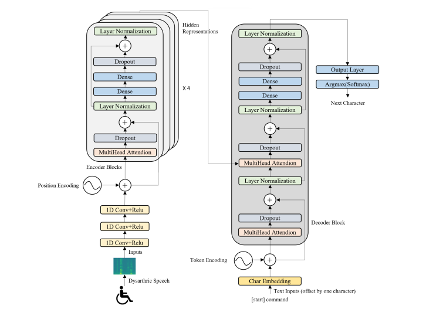

# Dysarthric Speech Recognition using Transformer

This project is focused on building a **Dysarthric Speech Recognition System** using a Transformer-based model. The system is designed to process and recognize speech patterns specifically for dysarthric speakers, who have motor speech disorders that affect articulation and speech intelligibility.

## Table of Contents

- [Project Overview](#project-overview)
- [Dataset](#dataset)
- [Model Architecture](#model-architecture)
- [Installation](#installation)
- [Usage](#usage)
- [Directory Structure](#directory-structure)
- [Training and Evaluation](#training-and-evaluation)
- [Results](#results)
- [References](#references)

## Project Overview

Dysarthria is a motor speech disorder resulting from neurological injury that leads to poor speech intelligibility. In this project, we aim to develop an automatic speech recognition (ASR) system that can help transcribe dysarthric speech using a Transformer-based model.

This project uses the **UASpeech dataset** and focuses on transforming the input audio signals to text while dealing with the irregularities in the speech patterns of dysarthric individuals.

## Dataset

We use the [UASpeech dataset](https://www.isca-speech.org/archive/Interspeech_2008/papers/i08_1741.pdf), which contains speech samples from dysarthric speakers. This dataset is essential for training models that can handle non-standard speech patterns.

- **Source Directory**: `D:\Mtechs3\project\UASpeech_original_FM\UASpeech\audio\original\M10`
- **Test Set**: A random 20% split of the dataset is used for testing.

You will need to have access to this dataset to train and evaluate the model.

## Model Architecture

We utilize a **Transformer-based architecture** for speech-to-text conversion. The model consists of an encoder to process the audio features and a decoder for character-level prediction.

### Key Features:
- Character-level embeddings for speech recognition.
- Transformer layers for capturing long-range dependencies in speech.
- Greedy decoding for inference.
- Supports dysarthric speech, which requires handling complex speech patterns.

The following diagram shows the architecture of our Transformer-based model for dysarthric speech recognition:




## Installation

To get started, follow these steps:

1. **Clone the repository**:
   ```bash
   git clone https://github.com/yourusername/dysarthric-speech-recognition.git
   cd dysarthric-speech-recognition

